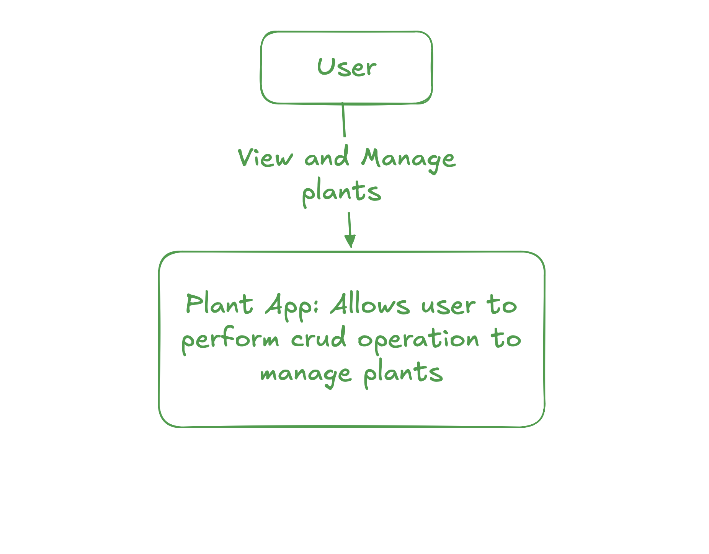
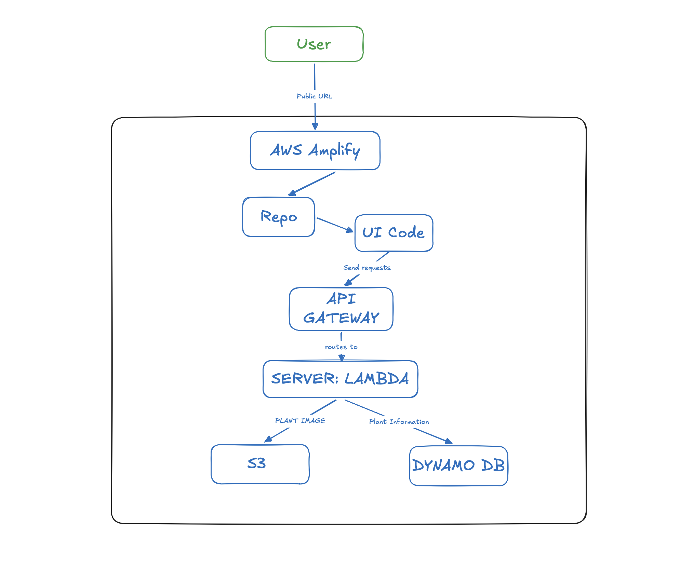

# Plant App

**Overview:**

## Tech Stack

- **Frontend:** JavaScript / CSS / HTML
- **Hosting:** AWS Amplify
- **API Gateway:** AWS API Gateway
- **Backend:** AWS Lambda
- **Database:** DynamoDB
- **Storage:** S3

Amplify hosts the static frontend, which calls API Gateway to invoke Lambda functions. Lambda reads and writes plant records in DynamoDB and plant images in S3. Backend and infrastructure are currently configured manually in the AWS console (not yet in this repo).

## Functional Requirements

- **F1:** Create new plant entry
- **F2:** View All plant
- **F3:** Update Created Plant
- **F4:** Delete plant record

## Non-Functional Requirements

- **Scalability:** Should support max 5 user
- **Reliablity:** Operations should be successful 90% of the time
- **Performance:** Each action should take no more than 3 secs
- **Monitoring:** Each action should be logged
- **Availability:**
- **Security:**

## System Context Diagram

## Container Diagram

